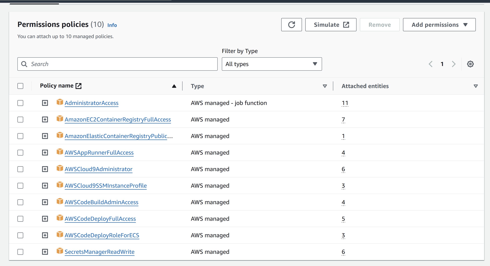

# Game Sales Query : Rust Polo DB Actix - MP5

## Description
In this project, we containerize an Rust Actix/Axum web application, which generates random numbers according to the amount of digits that a user wants. I also managed to deploy it to AWS Apprunner, making the microservice accessible via the cloud, versus a local level.

[Click Here for this Project's Demo Video!!!](https://www.youtube.com/watch?v=b7JuXXEUnbU)

## Why a lottery number generator?

One of the trademark conversation pieces for the elderly community in Puerto Rico actually revolves around playing the lotto games, known as "Pega 3", "Pega 4", and "Lotería Electrónica". I would often see them strike new friendships and conversations about what number combination looks pretty, how it wouldn't hurt to have an extra 200 dollars, and how they would be happy with even with 10,000 dollars, not even a full 100K. I thought it would be nice if I had a number for them for the next time in which I see them. However, I don't want them to use the app if it means them losing the conversation piece. It should be an afterthought if and only if they needed a bit more numerical inspiration.

## Usage

Apprunner Actix Version Link : https://qpmrrrsni2.us-east-2.awsapprunner.com/


At the link, add a "/digit" like "/4", to obtain your randomly generated number. Happy generating!!!!

To use the run the code directly, opt for one of these two options.

```
# local
cd lotto_actix # or lotto_randomizer
cargo build
cargo run
curl "localhost:8080/5" # 3000 for axum

# docker
make build
make rundocker
curl "localhost:8080/5" # 3000 for axum

```

## Prerequisites
For those not using the AWS Cloud 9 environment, the required setup will be installing the following:

* AWS cli (the most recent version)

* Add the permissions to the IAM User/Role for the cloud instance or developer environment. 

    * For the IAM user, I opted for this combination of permissions. The codedeploy ones are likely not necessary, but I didn't test that case.

    

    * For the AWS Cloud 9 role attached to the instance, I chose these permissions.

    

## Setup Instructions

1. Make a directory for the project and navigate inside it.
```
$ cargo new your_project
$ cd your_project
```
2. Specify your logic in the lib.rs and the main.rs. Here is a specific look at the web framework : axum.
```
use actix_web::{web, App, HttpResponse, HttpServer, Responder};
use rand::Rng;

fn generate_random_number(digits: usize) -> u32 {
    let mut rng = rand::thread_rng();
    let min_value = 10u32.pow(digits as u32 - 1);
    let max_value = 10u32.pow(digits as u32) - 1;
    rng.gen_range(min_value..=max_value)
}

async fn index() -> impl Responder {
    HttpResponse::Ok().body("Welcome to the Random Number Generator! To generate a random number, add the desired number of digits to the URL, e.g., /5 \n\n\n
    Bienvenidos al generador aleatorio de numeros, para inspirar sus opciones de Pega 3 , Pega 4"
    )
    # I ellided the rest of the text for length
}

async fn random_number_handler(info: web::Path<(usize,)>) -> impl Responder {
    let digits = info.into_inner().0;
    let random_number = generate_random_number(digits);
    HttpResponse::Ok().body(format!(
        "Random number with {} digits / Numero Aleatorio de {} digitos : {} \n",
        digits, digits, random_number
    ))
}

#[actix_web::main]
async fn main() -> std::io::Result<()> {
    HttpServer::new(|| {
        App::new()
            .service(web::resource("/").route(web::get().to(index)))
            .service(web::resource("/{digits}").route(web::get().to(random_number_handler)))
    })
    // .bind("127.0.0.1:8080")?
    .bind("0.0.0.0:8080")?
    .run()
    .await
}
```
3. Build the project. Run the project in the terminal. 
```
cargo build
cargo run
```


4. In a separate terminal session, run "curl 'localhost:3000'" and "curl 'localhost:3000/5'", to see if it works locally. Remember to adjust these commands to the unique functionality of your microservice. 
```
curl 'localhost:8080'
curl 'localhost:8080/5'
# port 3000 for axum version of project
```


5. Terminate your original terminal session running the "cargo run" command with by pressing control+c. Now, Proceed to building your docker. The dockerfile used for the project is derived from the MLOPS [template](https://github.com/nogibjj/rust-mlops-template/blob/main/webdocker/Dockerfile) from [Noah Gift](https://noahgift.com/). 
```
docker build -t any_lowercase_name_for_your_image .
```


#### Warning : Hours of Debugging Can be Avoided

This docker file had to be modified because a mix of two errors were very prevalent. Building the docker image, the image does not appear in docker image ls or anything of the sort. When running the image, the GLIBC_2.XX errors come up. The fix was replacing the debian image with debian:testing. However, a new error "curl: (56) Recv failure: Connection reset by peer" crept up that I couldn't debug, and I discovered it was an issue with the port binding, so I changed the binding in the main.rs to ".bind("0.0.0.0:8080")?". That was the final fix.  

```
FROM rust:latest as builder
ENV APP lotto_actix
WORKDIR /usr/src/$APP
COPY . .
RUN cargo install --path .

# use the testing debian
FROM debian:testing
# FROM debian:buster-slim
RUN apt-get update && rm -rf /var/lib/apt/lists/*
COPY --from=builder /usr/local/cargo/bin/$APP /usr/local/bin/$APP
#export this actix web service to port 8080 and 0.0.0.0
EXPOSE 8080
CMD ["lotto_actix"]
```

The axum friendly, docker file [template](https://gitlab.com/dukeaiml/duke-coursera-labs/rust-axum-greedy-coin-microservice/-/blob/main/Dockerfile?ref_type=heads) seen here is also a courtesy of Noah Gift. The command is the same. This method needed no special debugging or accomodations. You can already tell which of the two frameworks is my favorite.

6. Run the docker image, and this will be a great opportunity for you to access the port as soon as it runs, as you will be essentially accessing the app from the image. Remember to test your curl commands. I will also include the stopping commands as comments, as you will need to stop the container after you're done testing. At this point, if you want, you can stop here. 
```
docker run -dp 8080:8080 number_generator # 3000 for the axum version
# docker ps # to get the container id
# docker stop <your_container_id>
```


7. (Optional) Deploy the app to Apprunner : Part 1. We have to configure an ECR repository in AWS. It's an incredibly straightforward process, and I recommend making a public ECR repository. As soon as it is done, look for the push commands for your repository. Then appropriately push the image to the repository. I put my sequence of commands as a "make deploy-aws".


```
deploy-aws:
	cargo build
	aws ecr get-login-password --region us-east-2 | docker login --username AWS --password-stdin 667719398048.dkr.ecr.us-east-2.amazonaws.com	
	docker build -t lotto_actix .	
	docker tag lotto_actix:latest 667719398048.dkr.ecr.us-east-2.amazonaws.com/lotto_actix:latest
	docker push 667719398048.dkr.ecr.us-east-2.amazonaws.com/lotto_actix:latest
```

8. Final Step :  Configure to run on AWS Apprunner. I recommend the options shown in the image, allowing you to choose your public repository and having Apprunner automatically re-deploy the service as new images are pushed to AWS. As for the role, I was able to leverage the regular "AppRunnerECRAccessRole", without any special permissions for this project. If you needed to automate the process, Github Actions and different types of roles or permissions might be necessary.  

(DEFUNCT) Apprunner Axum Version Link:https://ja3mrdz8ra.us-east-2.awsapprunner.com/


For this image, I also changed the ports and adjusted the health checks, so that the deployment would not falsely fail quickly. If necessary, upgrade the virtual cpu for the service.


The link from your AppRunner, once deployed, is the link to your service, where the end user must add the required information (in my case, backslashes and digits) to access the functionality of the microservice. As for how my microservice appeared, look at my result section.


## Result

Assignment Requirement - Running the docker locally:


Here is an example of my deployed app, the lottery number generator.


## Licenses
Creative Commons.

## Status
This project is complete as of February 21, 2024.
