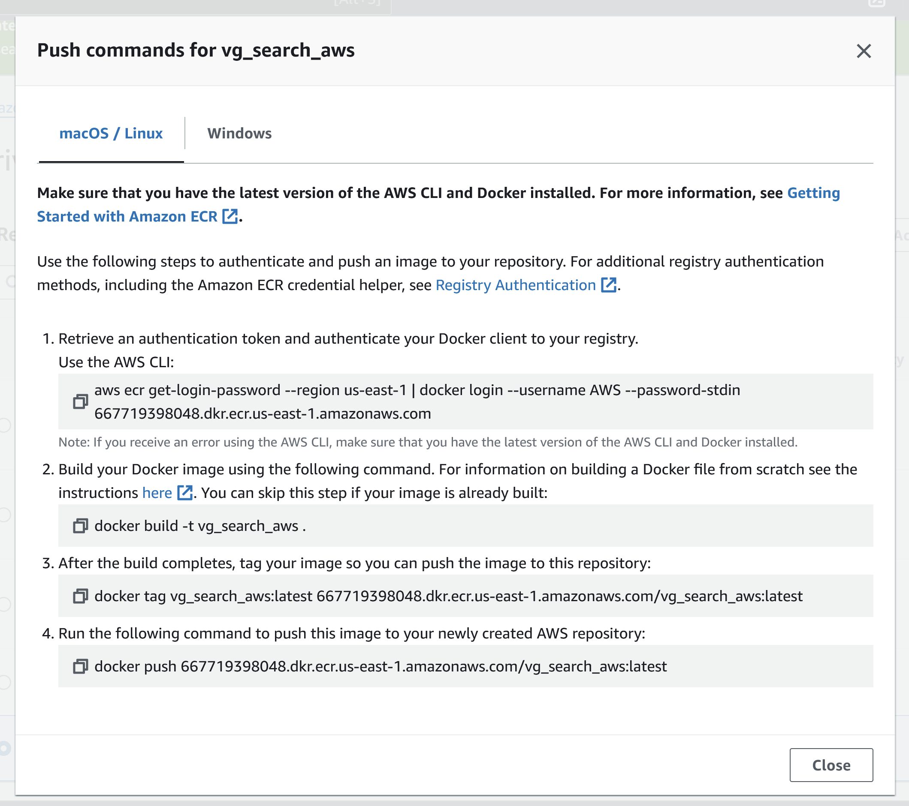
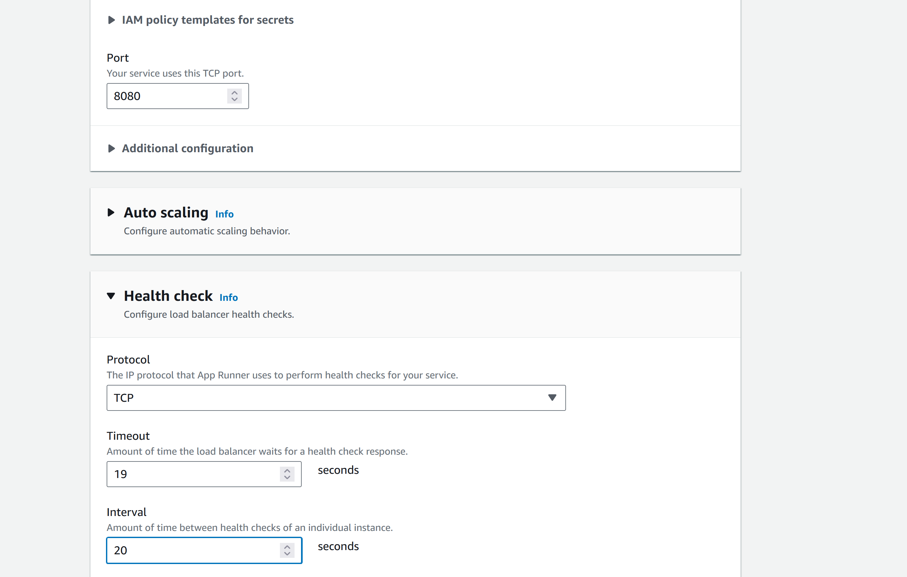

# Game Sales Query : Rust Polo DB Actix - MP5

## Description
In this project, we containerize an Actix web application that allows the user to query a game's sales data, from a PoloDB database, by providing said game's name. The original data comes from this [Kaggle repository] (https://www.kaggle.com/datasets/gregorut/videogamesales)(Thanks Gregorut!!!). This app's docker image is then deployed to AWS Elastic Container Registry (ECR), where its image is then deployed via AWS Apprunner, generating a link for public use.

[Click Here for this Project's Demo Video!!!](https://www.youtube.com/watch?v=b7JuXXEUnbU)

## Why opt for a game search query and polo db?

Polo DB is an excellent NoSQL vector database. It's a cool tool that I wanted to learn how to use, and I wanted to do a game search query because...it's fun.  

## Usage

Apprunner Actix Version Link : https://pf8igq3ghg.us-east-1.awsapprunner.com/


Try this queried search in honor of Akira Toriyama:

 https://pf8igq3ghg.us-east-1.awsapprunner.com/find_game/Dragon%20Ball:%20XenoVerse

Our recently departed Akira Toriyama (Creator of Dragon Ball and Designer for Dragon Quest) is hopefully blasting Kamehamehas in heaven after making our childhoods and adulthoods fun for so many years. As they say, put one hand in the sky for the spirit bomb to get a little brighter and bigger for the good man.

At the link, add a "/find_game/" with the name after the final slash, like "Super Mario Bros.", so it would look like "link/find_game/Super Mario Bros." to see the sales data for this game. It's case sensitive, so it might take a few tries. Try "Tetris" and a few others from the Kaggle link above for a few runs. 

## Quick Usage

To use the demo run the code quickly and directly, opt for one of these two options.

```
# local
make local-run
curl "localhost:8080/find_game/Tetris" # Or any game you want, case sensitive

# docker
make local-docker-run
curl "localhost:8080/find_game/Mega Man Legends" # Hard to choose, too many good choices

```

## Pre-requisites
For those not using the AWS Cloud 9 environment, the required setup will be installing the following:

* AWS cli (the most recent version)

* Add the permissions to the IAM User/Role for the cloud instance or developer environment. 

    * For the IAM user, I opted for this combination of permissions. The codedeploy ones are likely not necessary, but I didn't test that case.

    

    * For the AWS Cloud 9 role attached to the instance, I chose these permissions.

    

## Setup Instructions

1. Make a directory for the project and navigate inside it.
```
$ cargo new your_project
$ cd your_project
```

2. I split the logic of the database creation and the app deployment to two different cargo projects. I hosted a csv in AWS S3 and made it public for use in my script. your logic in the lib.rs and the main.rs. Here is the logic for the database creation, its output which included some small tests, and my s3 creation. To try making the database, use ```make database-create```.
```
use polodb_core::{Database, Collection};
use polodb_core::bson::{Document, doc};
use std::error::Error;
use csv::ReaderBuilder;

// ellided code (...) to focus on the database creation 

fn main() -> Result<(), Box<dyn Error>> {
    // Create a database instance
    // let db = Database::open_memory()?; // to open in memory only
    let db = Database::open_file("vgtest-polo.db").unwrap();

    // Create a collection named "games"
    let typed_collection = db.collection::<Document>("games");

    // Read CSV file from a URL (you might need to use a library like reqwest to fetch the CSV)
    let csv_url = "https://vgexo.s3.us-west-1.amazonaws.com/vgsales.csv";
    let response = reqwest::blocking::get(csv_url)?;
    let csv_data = response.text()?;

    // Create a CSV reader
    let mut csv_reader = ReaderBuilder::new().from_reader(csv_data.as_bytes());

    // Iterate over each CSV record and insert it into the collection
    for result in csv_reader.records() {
        let record = result?;

        // Assuming your CSV has columns "title" and "author", adapt this to match your CSV structure
        let doc = doc! {
            "rank": &record[0], // Adjust the index based on your CSV structure
            "name": &record[1], // Adjust the index based on your CSV structure
            "platform": &record[2], // Adjust the index based on your CSV structure
            "year": &record[3], // Adjust the index based on your CSV structure
            "genre": &record[4], // Adjust the index based on your CSV structure
            "publisher": &record[5], // Adjust the index based on your CSV structure
            "na_sales": &record[6], // Adjust the index based on your CSV structure
            "eu_sales": &record[7], // Adjust the index based on your CSV structure
            "jp_sales": &record[8], // Adjust the index based on your CSV structure
            "other_sales": &record[9], // Adjust the index based on your CSV structure
            "global_sales": &record[10], // Adjust the index based on your CSV structure
        };

        // Insert the document into the collection
        typed_collection.insert_one(doc)?;
    }

    let game_search = typed_collection.find(doc! {
        "name": "Pokemon Gold/Pokemon Silver"
    })?;
    println!("\n\n\n");
    println!("Pokemon Gold/Pokemon Silver");
    for game in game_search {
        println!("\nGame: {:?}", game);
    }   

    println!("\n\n\n");
    find_game_for_user(&typed_collection, "Final Fantasy VII");
    println!("\n\n\n Test is complete, database functional.");

    Ok(())
}
```
    S3 - Making Objects Public with ACL
    
    

    The Output for This Step:
    

3. For the logic of hosting the app, I sent the database, generated by the prior step, to S3 and made it public, getting a link for public use. Then I chose Actix for the main web framework, where I download the database and let the user query data. I curled the query in a joint terminal session to show the output.
```
# local
make local-run # cd game_search_web_app, cargo build, cargo run
curl "localhost:8080/find_game/Tetris" # Or any game you want, case sensitive
```

```
use actix_web::{web, App, HttpResponse, HttpServer, Responder};
use polodb_core::{Database, Collection};
use polodb_core::bson::{Document, doc};
use std::sync::Arc;

// elided code to focus on game search and its handler

// Define your function to find a game for a user
fn find_game_for_user(collection: &Collection<Document>, game_name: &str) -> Option<Document> {
    let query = doc! {
        "name": game_name,
    };

    collection.find_one(query).unwrap()
}

// Define a handler function for your endpoint
async fn find_game_handler(data: web::Data<Arc<Collection<Document>>>, game_name: web::Path<String>) -> impl Responder {
    // Call your function to find the game
    match find_game_for_user(&data.as_ref(), &game_name) {
        Some(result) => {
            // Convert the JSON result to a newline-separated string
            let result_string = serde_json::to_string_pretty(&result).unwrap_or_else(|_| String::from("Failed to serialize result"));
            let result_string_with_newlines = result_string.replace(", ", ",\n");

            // Return the response with newline-separated content
            HttpResponse::Ok().body(result_string_with_newlines)
        },
        None => HttpResponse::NotFound().body("Game not found"),
    }
}
```
    Output of Cargo Run, curl the game Tetris
    

4. With the code working, I proceeded to create a docker image. The magic here was adding the database file uploaded to S3 to the docker image with the ADD command, which downloads the file to the root of the docker image, and everything worked from there. 
```
FROM rust:latest as builder
ENV APP game_search_web_app
WORKDIR /usr/src/$APP
COPY . .
RUN cargo install --path .

# Use the testing debian
FROM debian:testing
RUN apt-get update && rm -rf /var/lib/apt/lists/*
COPY --from=builder /usr/local/cargo/bin/$APP /usr/local/bin/$APP

# Copy the database file into the container
ADD https://vgexo.s3.us-west-1.amazonaws.com/vgtest-polo.db /

# Export this Actix web service to port 8080 and 0.0.0.0
EXPOSE 8080
CMD ["game_search_web_app"]
```

5. After creating a docker image, I queried the game Tetris. Here are the commands to create the image and the outputs. Something weird that I noticed was that names with spaces in them did not yield the correct output via the curl method, but did so correctly when using the browser.
```
# docker commands
# make local-docker-run, commands within this make below, except curl
cd game_search_web_app
docker build -t vg_search_actix .
docker run -dp 8080:8080 vg_search_actix # or docker run -it --rm -p 8080:8080 vg_search_actix
curl "localhost:8080/find_game/Tekken" 
```

    Docker Output:

    

    

7. (Optional) Deploy the app to Apprunner : Part 1. We have to configure an ECR repository in AWS. It's an incredibly straightforward process, and I recommend making a private ECR repository. As soon as it is done, look for the push commands for your repository. Then appropriately push the image to the repository. I put my sequence of commands as a "make deploy-aws".




```
deploy-aws-from-root:
	cd game_search_web_app &&\
		cargo build --release &&\
			docker build -t vg_search_aws .
	aws ecr get-login-password --region us-east-1 | docker login --username AWS --password-stdin 667719398048.dkr.ecr.us-east-1.amazonaws.com
	docker tag vg_search_aws:latest 667719398048.dkr.ecr.us-east-1.amazonaws.com/vg_search_aws:latest
	docker push 667719398048.dkr.ecr.us-east-1.amazonaws.com/vg_search_aws:latest
```


8. Final Step :  Configure to run on AWS Apprunner. I recommend the options shown in the image, allowing you to choose your public repository and having Apprunner automatically re-deploy the service as new images are pushed to AWS. As for the role, I was able to leverage the regular "AppRunnerECRAccessRole", without any special permissions for this project. If you needed to automate the process, Github Actions and different types of roles or permissions might be necessary. Check your region quotas to make sure you have enough resources to run the service. 


Consider adjusting the ports and health checks, so that the deployment would not falsely fail quickly. If necessary, upgrade the virtual cpu for the service.



The link from your AppRunner, once deployed, is the link to your service, where the end user must add the required information (in my case, backslashes and digits) to access the functionality of the microservice. As for how my microservice appeared, look at my result section.


## Result

Docker locally:

    

Here is an example of my deployed app, the game sales query microservice.

    

    

## Licenses
Creative Commons.

## Status
This project is complete as of March 2024.
